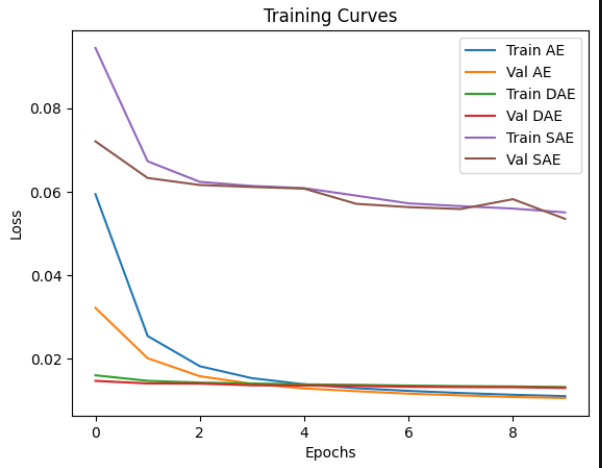
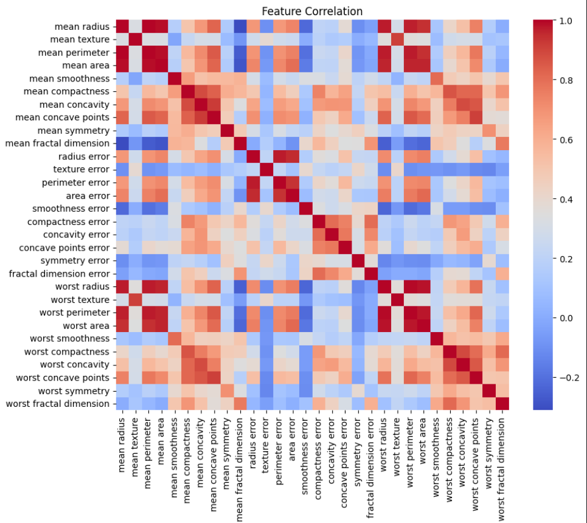
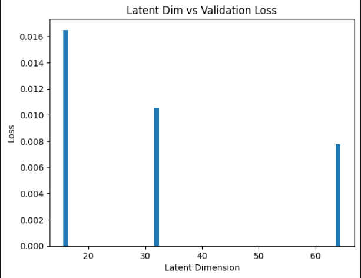
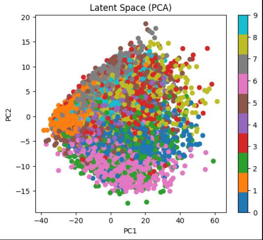
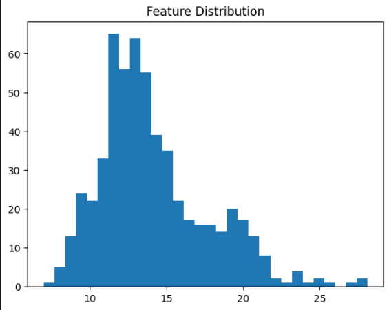
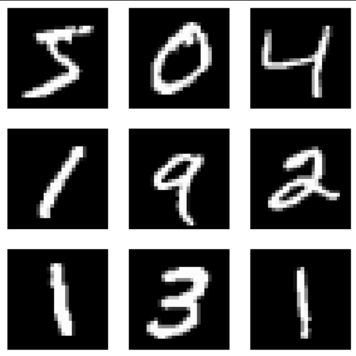

# Autoencoder Feature Learning

Autoencoder models for feature learning using MNIST dataset (AE, DAE, SAE)

---

## 📊 Results

### 🔹 Reconstruction

### 🔹 Heatmap

### 🔹 Latent Space

### 🔹 PCA Visualization

### 🔹 Data Distribution

### 🔹 MNIST Data 

